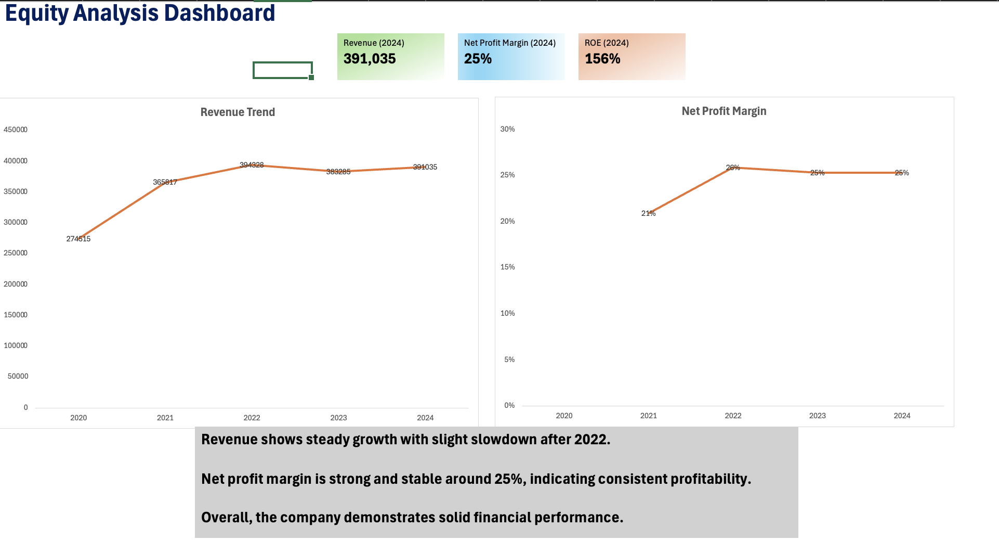

# equity-analysis-dashboard
Excel-based financial analysis dashboard (Apple Inc.)
# Equity Analysis Dashboard

Excel-based financial analysis dashboard using Apple Inc. data (2020–2024).

## 📊 Overview
This project analyzes key financial metrics:
- Revenue Trend
- Net Profit Margin
- Return on Equity (ROE)

## 📈 Dashboard Preview

## 🔍 Key Insights
- Revenue shows steady growth with slight slowdown after 2022.
- Net profit margin is stable around 25%.
- The company demonstrates solid financial performance.

## 🛠 Tools Used
- Microsoft Excel
- Data visualization (charts, KPIs)

## 📁 Files
- `Equity Analysis Project.xlsx` → main analysis file
  
